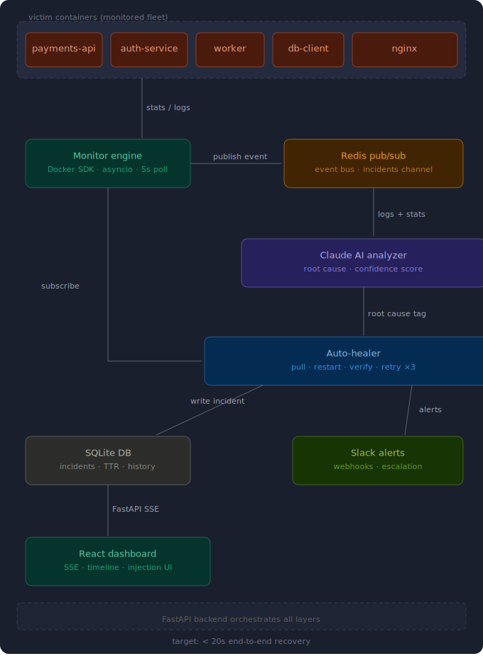

# Auto-Heal — Self-Repairing Container Infrastructure

> *It's 2am. Your phone goes off. Payment service is down.*
> Auto-Heal resolves it in under 20 seconds — while you sleep.

[](https://python.org)
[](https://fastapi.tiangolo.com)
[](https://react.dev)
[](https://anthropic.com)

---

## Problem Statement

In production, a single container crash triggers a 20-minute incident response: wake up an on-call engineer, SSH in, read logs, identify the root cause, restart the container, verify health, and go back to sleep. This is a fully automatable workflow that most teams still handle manually.

**Auto-Heal turns a 20-minute human incident into a 20-second automated recovery.**

The system continuously monitors a fleet of Docker containers, uses Claude AI to classify the root cause of any failure, automatically redeploys a healthy replacement, and notifies your team via Slack — all before a human even picks up their phone.

### Problem Validation

- On-call burnout is one of the top causes of DevOps engineer turnover — surveys consistently show 2–3am pages as the highest-friction part of the role.
- Container restarts (OOM kills, app crashes, dependency failures) account for the majority of production incidents that resolve themselves after a simple restart — making them ideal candidates for automation.
- Existing tools like Kubernetes self-healing require significant infrastructure investment. Auto-Heal delivers the same outcome with a single `docker-compose up`.

---

## Architecture



### Component Overview

```
Victim Containers (5x monitored fleet)
        │
        │  Docker stats + logs (every 5s)
        ▼
  Monitor Engine  ──────────────────────────────────────────────┐
  (Docker SDK · asyncio)                                        │
        │                                                        │
        │  publish incident event                               │
        ▼                                                        │
   Redis Pub/Sub                                                 │
   (incidents channel)                                           │
        │                                                        │
        │  subscribe                                             │
        ▼                                                        │
  Claude AI Analyzer  ←── logs + stats ───────────────────────┘
  (root cause · confidence score)
        │
        │  tagged incident
        ▼
   Auto-Healer
   (Pull · Restart · Verify · Retry ×3)
        │
        ├──── write incident ──► SQLite DB
        ├──── alerts ──────────► Slack Webhooks
        └──── FastAPI SSE ─────► React Dashboard
```

**Target: < 20 seconds end-to-end recovery**

### Data Flow — Failure to Recovery

| Step | Component | Action |
|------|-----------|--------|
| 1 | Monitor Engine | Detects failure within 30s via Docker SDK poll |
| 2 | Redis Pub/Sub | Publishes incident event to `incidents` channel |
| 3 | Claude Analyzer | Classifies root cause with confidence score |
| 4 | Auto-Healer | Pulls last-good image, replaces container |
| 5 | Health Verifier | Confirms HTTP health check passes before marking resolved |

---

## Key Design Decisions

| Layer | Choice | Rationale |
|-------|--------|-----------|
| Monitor | Docker SDK + asyncio, 5s poll | Direct API access, async, meets <30s detection requirement without Prometheus overhead |
| AI Brain | Claude Sonnet 4 + regex fast-path | Regex handles 85%+ of obvious failures instantly; Claude handles ambiguous cases — best of both approaches |
| Event Bus | Redis Pub/Sub | Decouples monitor from healer, enables parallel healing of multiple containers |
| Backend | FastAPI | Async routes, built-in Swagger docs, native SSE support via `StreamingResponse` |
| Frontend | React + Recharts + SSE | `EventSource` API gives true real-time updates without WebSocket complexity |
| Persistence | SQLite + SQLAlchemy | Zero config, no Postgres setup overhead in a 36-hour build |
| Alerts | Slack Webhooks | Fast setup, visible on phone during demo, free tier |

**Why not Prometheus + cAdvisor?** That stack requires 8+ hours of configuration. Docker SDK stats every 5 seconds achieves identical detection results in under 1 hour.

**Why a regex fast-path before Claude?** Claude API calls add ~1–2s latency and cost tokens. Six regex patterns cover OOM kills, connection refusals, import errors, segfaults, permission errors, and Python tracebacks — the vast majority of real-world failures. Claude is reserved for genuinely ambiguous cases, keeping the average TTR low and API costs minimal.

---

## Project Structure

```
.
├── autoheal/
│   ├── monitor/         # Async Docker container watcher (5s poll)
│   ├── analyzer/        # Claude AI root-cause classifier + regex fast-path
│   ├── healer/          # Pull → restart → verify → retry ×3 engine
│   ├── api/
│   │   ├── main.py      # FastAPI app + SSE stream endpoint
│   │   └── routes/      # /containers  /incidents  /inject
│   ├── alerts/          # Slack webhook integration
│   ├── db/              # SQLite models, CRUD, SQLAlchemy setup
│   ├── schemas/         # Pydantic models for incidents
│   ├── config/          # Environment variable settings
│   └── utils/           # Redis async client helpers
├── dashboard/
│   └── src/App.jsx      # React dashboard — SSE consumer, status cards, timeline
├── victims/             # 5 monitored containers (payments-api, auth-service, worker, db-client, nginx)
│   └── */
│       ├── app.py       # Flask service with /health endpoint
│       ├── inject.py    # Failure injection agent (OOM, crash, hang, dep, cpu)
│       └── Dockerfile
├── scripts/
│   ├── start.sh         # One-command startup helper
│   └── inject_all.sh    # Chaos testing — inject failures across all containers
├── tests/
│   ├── test_analyzer.py # Root-cause accuracy test suite (10 labeled cases)
│   └── test_monitor.py  # Monitor detection tests
├── docs/
│   ├── ARCHITECTURE.md  # Detailed architecture notes
│   ├── API.md           # FastAPI endpoint reference
│   └── DEMO_SCRIPT.md   # Step-by-step demo with exact timings
├── k8s/                 # Kubernetes / Helm chart (bonus)
├── docker-compose.yml
└── requirements.txt
```

---

## Setup Instructions

### Prerequisites

- Docker 27+ and Docker Compose
- Node.js 18+ (for dashboard)
- An [Anthropic API key](https://console.anthropic.com)
- A Slack app with Incoming Webhooks enabled (optional but recommended for demo)

### 1. Clone and configure

```bash
git clone https://github.com/your-team/auto-heal.git
cd auto-heal
cp .env.example .env
```

Edit `.env`:

```env
ANTHROPIC_API_KEY=sk-ant-...
SLACK_WEBHOOK_URL=https://hooks.slack.com/services/...
REDIS_URL=redis://redis:6379
DOCKER_SOCKET=/var/run/docker.sock
MONITOR_INTERVAL_S=5
MEM_THRESHOLD=0.85
CPU_THRESHOLD=0.90
HEAL_MAX_RETRIES=3
HEALTH_CHECK_TIMEOUT_S=5
HEALTH_VERIFY_TIMEOUT_S=30
```

### 2. Start the full stack

```bash
docker-compose up --build
```

This starts: Auto-Heal backend (port 8000), React dashboard (port 3000), Redis, and all 5 victim containers.

### 3. Open the dashboard

```
http://localhost:3000
```

All 5 containers should appear as green. You're ready to demo.

### 4. Inject a failure (optional manual test)

```bash
# Via API
curl -X POST http://localhost:8000/inject/payments-api/oom

# Via script (inject into all containers simultaneously)
bash scripts/inject_all.sh
```

---

## Failure Injection Modes

Each victim container ships with an `inject.py` agent. The dashboard's **Failure Injection** panel calls these via Docker exec — judges can trigger failures themselves.

| Mode | What it does | Expected root-cause tag |
|------|-------------|------------------------|
| `oom` | Allocates memory until OOM kill | `OOM` |
| `crash` | Logs a fake traceback and exits | `application_crash` |
| `hang` | Makes the `/health` endpoint stop responding | `application_crash` |
| `dep` | Corrupts the database URL and exits | `dependency_failure` |
| `cpu` | Spins 4 threads at 100% CPU | `application_crash` |

---

## API Reference

See [`docs/API.md`](./docs/API.md) for full endpoint docs. Key endpoints:

| Method | Endpoint | Description |
|--------|----------|-------------|
| `GET` | `/stream` | SSE stream — dashboard subscribes here for real-time events |
| `GET` | `/incidents?limit=50` | Recent incident history |
| `GET` | `/containers` | Status of all monitored containers |
| `POST` | `/inject/{container}/{mode}` | Trigger a failure injection |
| `GET` | `/docs` | Auto-generated Swagger UI |

---

## Root-Cause Categories

Claude classifies every incident into one of five categories with a confidence score:

| Category | Description | Example signals |
|----------|-------------|-----------------|
| `OOM` | Memory exhaustion / OOM kill | `OOMKilled`, `out of memory` |
| `application_crash` | Process exit, unhandled exception | `Traceback`, `panic:`, `SIGSEGV` |
| `dependency_failure` | Downstream service unreachable | `ECONNREFUSED`, `dial tcp` |
| `config_error` | Missing module, bad env var, permission denied | `ImportError`, `EACCES` |
| `unknown` | Insufficient signal for classification | — |

---

## Running Tests

```bash
# Analyzer accuracy (runs 10 labeled failure cases, target >80%)
pytest tests/test_analyzer.py -v

# Monitor detection tests
pytest tests/test_monitor.py -v
```

---

## Team

| Member | Role | Owns |
|--------|------|------|
| M1 | Backend / Infra Lead | Monitor engine, Auto-healer, Redis wiring |
| M2 | AI Engineer | Claude analyzer, regex fast-path, accuracy test suite |
| M3 | Frontend / Fullstack | React dashboard, Slack alerts, failure injection UI |
| M4 | DevOps / Demo Director | Victim containers, Docker Compose, architecture, demo script |

---

## Demo

See [`docs/DEMO_SCRIPT.md`](./docs/DEMO_SCRIPT.md) for the full 6-minute demo walkthrough.

**Quick version:**
1. Open dashboard — all 5 containers green
2. Inject memory exhaustion into `payments-api`
3. Watch Claude tag it as `OOM — 96% confidence` in real time
4. Container auto-heals, card snaps back to green — TTR: ~18s
5. Check Slack for the alert
6. Inject 3 simultaneous failures — watch parallel healing

---

*FastAPI backend orchestrates all layers · Target: < 20s end-to-end recovery*
